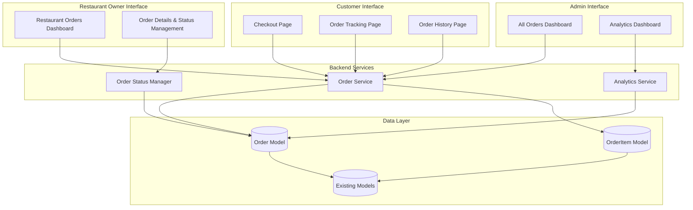
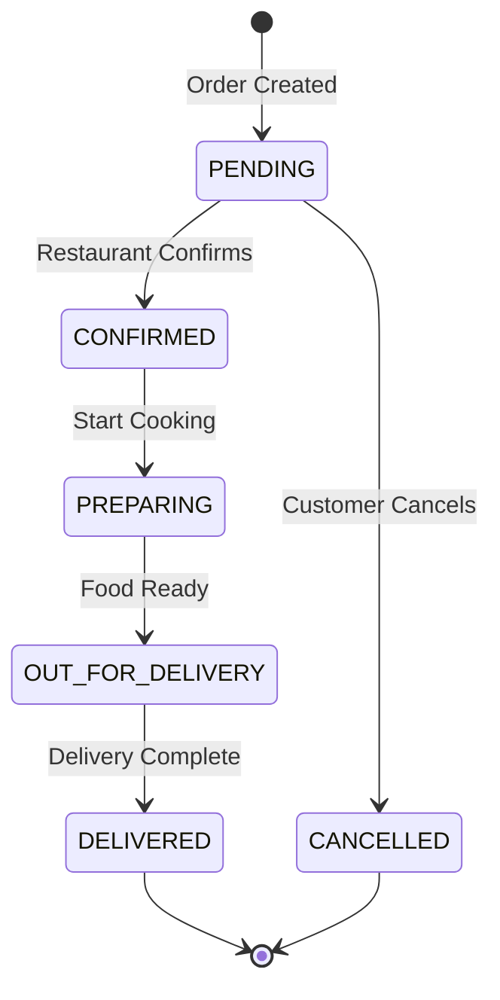
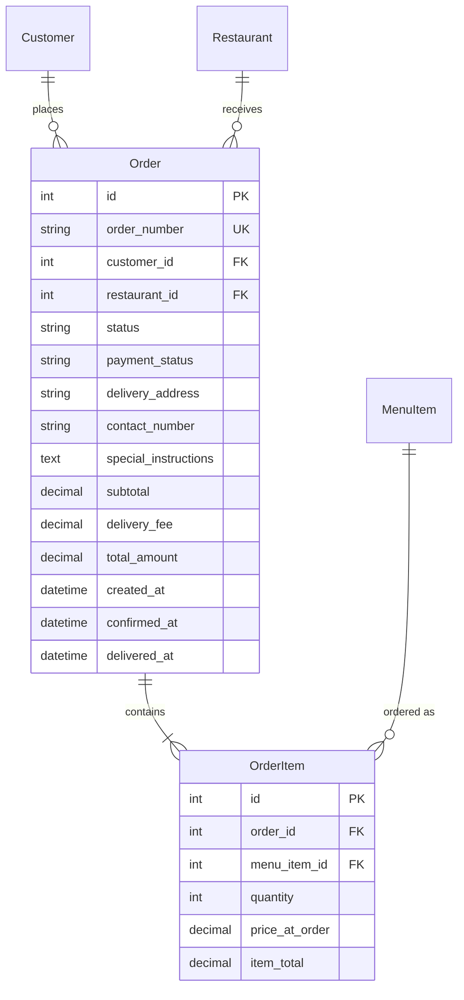

# Order Management System - Design Document

## Overview

The Order Management System extends the MealMate food delivery application by enabling complete order lifecycle management. The system allows customers to convert their shopping cart into orders, track order status in real-time, view order history, and enables restaurant owners to manage incoming orders through various fulfillment stages. Administrators gain oversight of all platform orders with analytics capabilities.

This design integrates seamlessly with the existing Django-based application, leveraging the current Customer, Restaurant, MenuItem, Cart, and CartItem models while introducing new Order and OrderItem models.

## Architecture

### System Components



### Technology Stack

- **Backend Framework**: Django 4.x
- **Database**: SQLite (development) / PostgreSQL (production ready)
- **Frontend**: Django Templates with Bootstrap 5
- **JavaScript**: Vanilla JS for dynamic updates
- **Authentication**: Django's built-in authentication system

### Design Patterns

1. **Model-View-Template (MVT)**: Django's standard pattern for separation of concerns
2. **Repository Pattern**: Encapsulate data access logic in model methods
3. **State Machine Pattern**: Order status transitions follow a defined state machine
4. **Post-Redirect-Get (PRG)**: Prevent duplicate form submissions

## Components and Interfaces

### 1. Data Models

#### Order Model

```python
class Order(models.Model):
    # Status choices
    STATUS_CHOICES = [
        ('PENDING', 'Pending'),
        ('CONFIRMED', 'Confirmed'),
        ('PREPARING', 'Preparing'),
        ('OUT_FOR_DELIVERY', 'Out for Delivery'),
        ('DELIVERED', 'Delivered'),
        ('CANCELLED', 'Cancelled'),
    ]
    
    # Payment status choices
    PAYMENT_STATUS_CHOICES = [
        ('PENDING', 'Pending'),
        ('COMPLETED', 'Completed'),
        ('FAILED', 'Failed'),
        ('REFUNDED', 'Refunded'),
    ]
    
    # Fields
    order_number = models.CharField(max_length=20, unique=True, editable=False)
    customer = models.ForeignKey(Customer, on_delete=models.CASCADE, related_name='orders')
    restaurant = models.ForeignKey(Restaurant, on_delete=models.CASCADE, related_name='orders')
    status = models.CharField(max_length=20, choices=STATUS_CHOICES, default='PENDING')
    payment_status = models.CharField(max_length=20, choices=PAYMENT_STATUS_CHOICES, default='PENDING')
    
    # Delivery information
    delivery_address = models.CharField(max_length=500)
    contact_number = models.CharField(max_length=15)
    special_instructions = models.TextField(max_length=500, blank=True)
    
    # Pricing
    subtotal = models.DecimalField(max_digits=10, decimal_places=2)
    delivery_fee = models.DecimalField(max_digits=10, decimal_places=2, default=30.00)
    total_amount = models.DecimalField(max_digits=10, decimal_places=2)
    
    # Timestamps
    created_at = models.DateTimeField(auto_now_add=True)
    confirmed_at = models.DateTimeField(null=True, blank=True)
    preparing_at = models.DateTimeField(null=True, blank=True)
    out_for_delivery_at = models.DateTimeField(null=True, blank=True)
    delivered_at = models.DateTimeField(null=True, blank=True)
    cancelled_at = models.DateTimeField(null=True, blank=True)
    
    # Methods
    def generate_order_number(self):
        """Generate unique order number: ORD-YYYYMMDD-XXXX"""
        
    def get_estimated_delivery_time(self):
        """Calculate estimated delivery time based on status"""
        
    def get_total_preparation_time(self):
        """Calculate time from order to delivery"""
        
    def can_be_cancelled(self):
        """Check if order can be cancelled (only if PENDING)"""
        
    def get_next_status_action(self):
        """Return the next valid status transition"""
```

#### OrderItem Model

```python
class OrderItem(models.Model):
    order = models.ForeignKey(Order, on_delete=models.CASCADE, related_name='items')
    menu_item = models.ForeignKey(MenuItem, on_delete=models.PROTECT)
    quantity = models.PositiveIntegerField()
    price_at_order = models.DecimalField(max_digits=8, decimal_places=2)
    item_total = models.DecimalField(max_digits=10, decimal_places=2)
    
    # Methods
    def calculate_item_total(self):
        """Calculate total for this order item"""
```

### 2. Views and URL Routing

#### Customer Views

```python
# Place order from cart
def place_order(request, username):
    """
    - Validate cart has items
    - Create Order from cart items
    - Create OrderItem for each cart item
    - Clear cart
    - Redirect to order confirmation
    """

# View active orders
def customer_orders(request, username):
    """
    - Fetch all orders for customer
    - Filter active orders (not Delivered/Cancelled)
    - Display with current status
    """

# View order history
def order_history(request, username):
    """
    - Fetch all orders for customer
    - Support filtering by date range and restaurant
    - Display in reverse chronological order
    """

# View order details
def order_detail(request, username, order_id):
    """
    - Fetch specific order
    - Display all items, status, timestamps
    - Show cancel button if applicable
    """

# Cancel order
def cancel_order(request, username, order_id):
    """
    - Verify order belongs to customer
    - Check if cancellable (status = PENDING)
    - Update status to CANCELLED
    - Record cancellation timestamp
    """
```

#### Restaurant Owner Views

```python
# Restaurant orders dashboard
def restaurant_orders(request, restaurant_id):
    """
    - Fetch all orders for restaurant
    - Group by status
    - Sort pending orders first
    """

# Update order status
def update_order_status(request, order_id):
    """
    - Verify restaurant ownership
    - Validate status transition
    - Update status and timestamp
    - Redirect back to dashboard
    """
```

#### Admin Views

```python
# All orders dashboard
def admin_all_orders(request):
    """
    - Fetch all orders across restaurants
    - Support filtering by status, date, restaurant
    - Display summary statistics
    """

# Analytics dashboard
def admin_analytics(request):
    """
    - Calculate order statistics
    - Generate revenue reports
    - Display trends over time
    """
```

### 3. URL Configuration

```python
urlpatterns = [
    # Customer order URLs
    path('order/place/<str:username>/', views.place_order, name='place_order'),
    path('orders/<str:username>/', views.customer_orders, name='customer_orders'),
    path('orders/<str:username>/history/', views.order_history, name='order_history'),
    path('orders/<str:username>/<int:order_id>/', views.order_detail, name='order_detail'),
    path('orders/<str:username>/<int:order_id>/cancel/', views.cancel_order, name='cancel_order'),
    
    # Restaurant owner URLs
    path('restaurant/<int:restaurant_id>/orders/', views.restaurant_orders, name='restaurant_orders'),
    path('restaurant/order/<int:order_id>/update-status/', views.update_order_status, name='update_order_status'),
    
    # Admin URLs
    path('admin/orders/', views.admin_all_orders, name='admin_all_orders'),
    path('admin/analytics/', views.admin_analytics, name='admin_analytics'),
]
```

### 4. Templates

#### customer_orders.html
- Display active orders with status badges
- Show order number, restaurant, total, and timestamp
- Link to order details
- Visual status indicator (progress bar or timeline)

#### order_history.html
- List all past orders
- Filter controls (date range, restaurant)
- Order summary cards
- Link to detailed view

#### order_detail.html
- Complete order information
- Item list with quantities and prices
- Status timeline showing progression
- Cancel button (conditional)
- Estimated delivery time

#### restaurant_orders.html
- Tabbed interface for different statuses
- Order cards with customer info
- Quick action buttons for status updates
- Special instructions highlighted

#### admin_all_orders.html
- Comprehensive order table
- Advanced filtering options
- Export functionality
- Summary statistics at top

#### admin_analytics.html
- Charts and graphs for trends
- Revenue breakdown by restaurant
- Order volume metrics
- Performance indicators

## Data Models

### Order Status State Machine



### Database Schema Relationships



### Key Design Decisions

1. **Price Snapshot**: OrderItem stores `price_at_order` to preserve historical pricing even if menu prices change
2. **Order Number Format**: Human-readable format (ORD-20251023-0001) for easy reference
3. **Status Timestamps**: Separate timestamp fields for each status enable accurate tracking and analytics
4. **Restaurant Association**: Orders link directly to restaurant for efficient querying
5. **Soft Constraints**: Use `models.PROTECT` on MenuItem to prevent deletion of items that have been ordered

## Error Handling

### Validation Errors

1. **Empty Cart**: Display error message if user tries to checkout with empty cart
2. **Invalid Status Transition**: Prevent illegal status changes (e.g., DELIVERED → PREPARING)
3. **Unauthorized Access**: Verify user permissions before allowing order operations
4. **Cancelled Order Modification**: Prevent any changes to cancelled orders

### Error Messages

```python
ERROR_MESSAGES = {
    'EMPTY_CART': 'Your cart is empty. Please add items before checking out.',
    'INVALID_STATUS': 'Cannot update order to this status.',
    'UNAUTHORIZED': 'You do not have permission to perform this action.',
    'CANNOT_CANCEL': 'This order cannot be cancelled as it has already been confirmed.',
    'ORDER_NOT_FOUND': 'Order not found.',
    'PAYMENT_FAILED': 'Payment processing failed. Please try again.',
}
```

### Exception Handling Strategy

- Use Django's `get_object_or_404` for model lookups
- Wrap critical operations in try-except blocks
- Log errors for debugging
- Display user-friendly messages
- Redirect to appropriate pages on errors

## Testing Strategy

### Unit Tests

1. **Model Tests**
   - Test order number generation uniqueness
   - Validate status transition logic
   - Test calculation methods (totals, delivery time)
   - Verify can_be_cancelled() logic

2. **View Tests**
   - Test order creation from cart
   - Verify cart clearing after order
   - Test status update permissions
   - Validate filtering and sorting

3. **Form Tests**
   - Test special instructions validation
   - Verify delivery address requirements
   - Test contact number format

### Integration Tests

1. **Order Flow Tests**
   - Complete order placement workflow
   - Status progression from PENDING to DELIVERED
   - Order cancellation flow
   - Restaurant owner order management

2. **Permission Tests**
   - Customer can only view own orders
   - Restaurant owner can only manage own restaurant orders
   - Admin can access all orders

3. **Data Integrity Tests**
   - Cart items correctly transferred to order items
   - Prices preserved at order time
   - Timestamps recorded accurately

### Test Data Setup

```python
# Fixtures for testing
- Create test customers
- Create test restaurants with menu items
- Create orders in various statuses
- Create order items with different quantities
```

### Manual Testing Checklist

- [ ] Customer can place order from cart
- [ ] Order appears in restaurant owner dashboard
- [ ] Restaurant owner can update status through all stages
- [ ] Customer sees status updates in real-time
- [ ] Customer can cancel pending orders
- [ ] Customer cannot cancel confirmed orders
- [ ] Order history displays correctly
- [ ] Filtering works on order history
- [ ] Admin can view all orders
- [ ] Analytics display correct calculations
- [ ] Special instructions appear for restaurant owner
- [ ] Estimated delivery time calculates correctly

## Performance Considerations

### Database Optimization

1. **Indexes**: Add database indexes on frequently queried fields
   - `order_number` (unique index)
   - `customer_id` + `created_at` (composite index for order history)
   - `restaurant_id` + `status` (composite index for restaurant dashboard)
   - `status` + `created_at` (for admin filtering)

2. **Query Optimization**
   - Use `select_related()` for foreign key relationships
   - Use `prefetch_related()` for reverse foreign keys (order items)
   - Implement pagination for order lists

3. **Caching Strategy**
   - Cache restaurant order counts
   - Cache analytics data (refresh every 5 minutes)
   - Use Django's cache framework for frequently accessed data

### Scalability Considerations

- Order creation is transactional to ensure data consistency
- Status updates are atomic operations
- Consider message queue (Celery) for future real-time notifications
- Database connection pooling for concurrent requests

## Security Considerations

1. **Authorization**: Verify user permissions on all order operations
2. **CSRF Protection**: Use Django's CSRF tokens on all forms
3. **SQL Injection**: Use Django ORM parameterized queries
4. **XSS Prevention**: Escape user input in templates
5. **Data Privacy**: Customers can only access their own orders
6. **Audit Trail**: Maintain timestamps for all status changes

## Future Enhancements

1. **Real-time Notifications**: WebSocket integration for live order updates
2. **Email Notifications**: Send order confirmation and status update emails
3. **SMS Notifications**: Text message updates for order status
4. **Rating System**: Allow customers to rate orders after delivery
5. **Reorder Functionality**: One-click reorder from order history
6. **Advanced Analytics**: Machine learning for demand forecasting
7. **Delivery Driver Module**: Separate interface for delivery personnel
8. **Multi-restaurant Orders**: Support ordering from multiple restaurants
